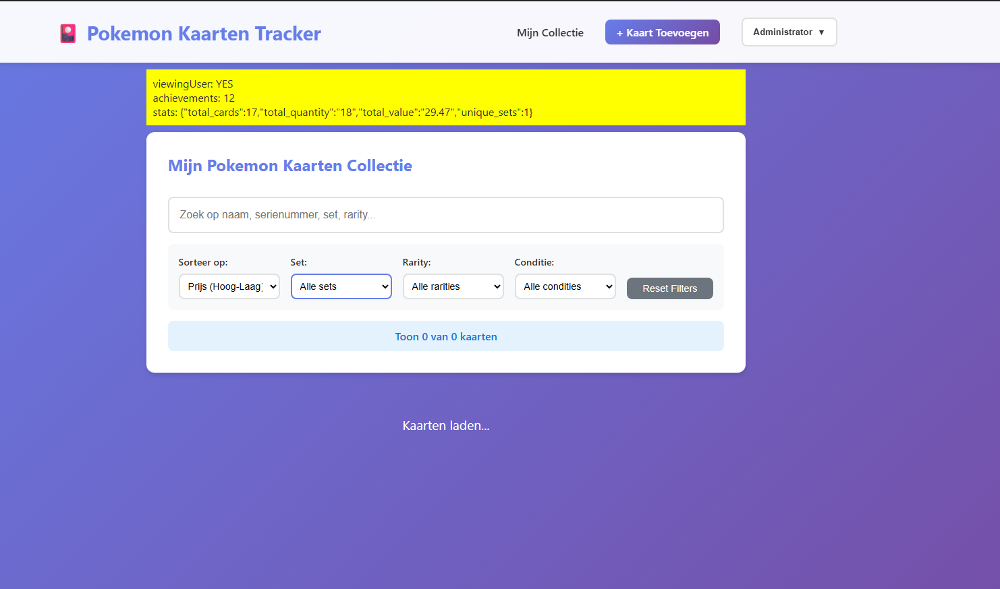

# 🎴 Pokemon Kaarten Tracker

Een complete webapplicatie om je Pokemon kaartenverzameling te digitaliseren en beheren met sociale features. De applicatie haalt automatisch actuele prijzen op van Cardmarket.com via web scraping.

## ✨ Features

- ✅ **CRUD Operaties**: Kaarten toevoegen, bewerken en verwijderen
- 🔍 **Zoekfunctie**: Zoek op kaartnaam, serienummer of set
- 💰 **Prijs Tracking**: Automatische prijsupdates van Cardmarket.com
- 📊 **Collectie Statistieken**: Overzicht van totale waarde en aantal kaarten
- 🌐 **Web Scraper**: Import kaartgegevens direct vanaf Cardmarket URL's
- 👥 **Vriendensysteem**: Stuur vriendverzoeken en bekijk elkaars collecties
- 💬 **Real-time Chat**: Chat met je vrienden
- 🏆 **Leaderboards**: Zie wie de meest waardevolle collectie heeft
- 👤 **Profielbeheer**: Pas je profiel aan en beheer privacy instellingen
- 🔒 **Privacy Controls**: Maak je collectie publiek of alleen zichtbaar voor vrienden
- 🐳 **Docker**: Volledige applicatie draait in Docker containers
- 📱 **Responsive Design**: Werkt op desktop en mobiele apparaten

## 🛠️ Tech Stack

- **Frontend**: Vue 3 + Vite
- **Backend**: PHP 8.2 met Apache
- **Database**: MySQL 8.0
- **Reverse Proxy**: Nginx
- **Containerization**: Docker & Docker Compose

## 📋 Vereisten

- Docker Desktop (Windows/Mac) of Docker + Docker Compose (Linux)
- Git (optioneel, voor clonen van repository)

## 🚀 Installatie & Setup

### 1. Project Downloaden

```powershell
cd c:\
git clone <jouw-repo-url> pokemon-tracker
cd pokemon-tracker
```

Of download en extract de projectbestanden naar `c:\pokemon-tracker`

### 2. Applicatie Starten

Open PowerShell in de projectmap en voer uit:

```powershell
docker-compose up -d
```

Dit proces kan enkele minuten duren bij de eerste keer, omdat:
- Alle Docker images worden gedownload
- De containers worden gebouwd
- NPM packages automatisch worden geïnstalleerd

### 3. Volg de Startup Logs (Optioneel)

Om te zien wanneer alles klaar is:

```powershell
docker-compose logs -f frontend
```

Wacht tot je ziet: `VITE ... ready in ... ms` en druk dan Ctrl+C.

### 4. Controleer of Alles Draait

```powershell
docker-compose ps
```

Je zou drie draaiende containers moeten zien:
- `pokemon_db` (MySQL database)
- `pokemon_backend` (PHP API)
- `pokemon_frontend` (Vue applicatie)

### 5. Open de Applicatie

- **Frontend**: http://localhost:8081
- **Backend API**: http://localhost:8080/api/cards

## 📖 Gebruik

### Kaart Toevoegen

1. Klik op "Kaart Toevoegen"
2. **Optie 1 - Import vanaf Cardmarket**:
   - Plak de Cardmarket URL in het veld
   - Klik op "Gegevens Ophalen"
   - Controleer en vul eventueel aan
   - Klik op "Kaart Toevoegen"

3. **Optie 2 - Handmatig invoeren**:
   - Vul serienummer en kaartnaam in (verplicht)
   - Vul overige velden in naar wens
   - Klik op "Kaart Toevoegen"

### Kaart Bewerken

1. Klik op de "Bewerken" knop bij een kaart
2. Pas de gegevens aan
3. Klik op "Wijzigingen Opslaan"

### Prijs Updaten

1. Zorg dat de kaart een Cardmarket URL heeft
2. Klik op "Prijs Updaten" bij de kaart
3. De huidige prijs wordt opgehaald en opgeslagen

### Kaart Verwijderen

1. Klik op "Verwijderen" bij een kaart
2. Bevestig de verwijdering

### Zoeken

Gebruik de zoekbalk bovenaan om te zoeken op:
- Kaartnaam
- Serienummer
- Set naam

## 🗄️ Database Structuur

De `cards` tabel bevat de volgende velden:

| Veld | Type | Beschrijving |
|------|------|--------------|
| id | INT | Primary key |
| serial_number | VARCHAR(50) | Uniek serienummer |
| card_name | VARCHAR(255) | Naam van de kaart |
| set_name | VARCHAR(255) | Pokemon set |
| card_number | VARCHAR(20) | Nummer in de set |
| rarity | VARCHAR(50) | Zeldzaamheid |
| condition_card | VARCHAR(20) | Conditie van de kaart |
| quantity | INT | Aantal exemplaren |
| purchase_price | DECIMAL(10,2) | Aankoopprijs |
| current_price | DECIMAL(10,2) | Huidige marktprijs |
| cardmarket_url | VARCHAR(500) | Cardmarket product URL |
| image_url | VARCHAR(500) | URL van kaartafbeelding |
| last_price_update | TIMESTAMP | Laatste prijs update |
| notes | TEXT | Extra notities |
| created_at | TIMESTAMP | Aanmaakdatum |
| updated_at | TIMESTAMP | Laatste wijziging |

## 🔌 API Endpoints

### Kaarten

- `GET /api/cards` - Alle kaarten ophalen
- `GET /api/cards/{id}` - Enkele kaart ophalen
- `GET /api/cards/serial?serial={nummer}` - Kaart ophalen op serienummer
- `GET /api/cards/search?q={zoekterm}` - Kaarten zoeken
- `POST /api/cards` - Nieuwe kaart aanmaken
- `PUT /api/cards/{id}` - Kaart bijwerken
- `DELETE /api/cards/{id}` - Kaart verwijderen

### Prijzen & Scraping

- `GET /api/cards/price/{id}` - Prijs updaten van Cardmarket
- `POST /api/scrape` - Cardmarket URL scrapen (body: `{"url": "..."}`)

## 🐛 Troubleshooting

### Containers starten niet

```powershell
# Stop alle containers
docker-compose down

# Verwijder oude containers en volumes
docker-compose down -v

# Start opnieuw
docker-compose up -d
```

### Database connectie problemen

```powershell
# Check database logs
docker logs pokemon_db

# Herstart database
docker-compose restart db
```

### Frontend build errors

```powershell
# Ga de frontend container in
docker exec -it pokemon_frontend sh

# Installeer dependencies opnieuw
npm install

# Build opnieuw
npm run build
```

### Ports al in gebruik

Als poort 8080, 8081 of 3306 al in gebruik is, pas dan de poorten aan in `docker-compose.yml`:

```yaml
ports:
  - "8082:80"  # Wijzig eerste getal naar een vrije poort
```

### Cardmarket scraping werkt niet

- Cardmarket kan hun HTML structuur veranderen, waardoor de scraper moet worden aangepast
- Cardmarket kan rate limiting toepassen bij te veel verzoeken
- Controleer of de URL correct is en de pagina bereikbaar is

## 🛑 Stoppen van de Applicatie

```powershell
# Stop containers maar behoud data
docker-compose stop

# Stop en verwijder containers (data blijft bewaard)
docker-compose down

# Stop en verwijder alles inclusief data
docker-compose down -v
```

## 🔄 Updates & Onderhoud

### Logs bekijken

```powershell
# Alle logs
docker-compose logs

# Specifieke service
docker-compose logs backend
docker-compose logs frontend
docker-compose logs db

# Follow logs real-time
docker-compose logs -f
```

### Database backup

```powershell
docker exec pokemon_db mysqldump -u pokemon_user -ppokemon_pass pokemon_cards > backup.sql
```

### Database restore

```powershell
docker exec -i pokemon_db mysql -u pokemon_user -ppokemon_pass pokemon_cards < backup.sql
```

## 📝 Database Direct Benaderen

```powershell
docker exec -it pokemon_db mysql -u pokemon_user -ppokemon_pass pokemon_cards
```

Voorbeeldqueries:

```sql
-- Alle kaarten tonen
SELECT * FROM cards;

-- Totale waarde berekenen
SELECT SUM(current_price * quantity) as total_value FROM cards;

-- Kaarten per set
SELECT set_name, COUNT(*) as count FROM cards GROUP BY set_name;    
```

## 🔐 Beveiliging

⚠️ **Let op**: Deze setup is bedoeld voor lokaal gebruik. Voor productie:

1. Wijzig alle wachtwoorden in `.env`
2. Voeg authenticatie toe aan de API
3. Gebruik HTTPS
4. Implementeer rate limiting
5. Valideer en sanitize alle inputs

## 📚 Projectstructuur

```
pokemon-tracker/
├── backend/                 # PHP Backend
│   ├── config/             # Database configuratie
│   ├── models/             # Card model
│   ├── services/           # Cardmarket scraper
│   ├── index.php           # API routes
│   ├── Dockerfile
│   └── .htaccess
├── frontend/               # Vue Frontend
│   ├── src/
│   │   ├── components/    # Vue componenten
│   │   ├── services/      # API client
│   │   ├── App.vue
│   │   └── main.js
│   ├── Dockerfile.dev     # Dev container
│   ├── Dockerfile.prod    # Production build
│   ├── package.json
│   └── vite.config.js
├── nginx/                 # Nginx configuratie
│   ├── nginx.conf        # Development config
│   └── nginx.prod.conf   # Production config
├── database/              # Database scripts
│   ├── init.sql          # Database schema
│   └── migrations/       # Database migraties
├── docker-compose.yml     # Development setup
├── docker-compose.prod.yml # Production setup
├── .env.example          # Environment template
└── README.md             # Deze file
```

## 🚀 Deployment op NAS (Portainer)

### Voorbereiding

1. **GitHub Repository Setup**

```powershell
# In je project directory
git init
git add .
git commit -m "Initial commit"
git branch -M main
git remote add origin https://github.com/jouw-username/pokemon-tracker.git
git push -u origin main
```

2. **Environment Configuratie**

Maak een `.env` bestand op je NAS met de volgende inhoud (of configureer in Portainer):

```env
HTTP_PORT=8080
MYSQL_ROOT_PASSWORD=jouw_veilig_wachtwoord
MYSQL_DATABASE=pokemon_cards
MYSQL_USER=pokemon_user
MYSQL_PASSWORD=jouw_database_wachtwoord
VITE_API_URL=http://192.168.1.100:8080/api
```

**Belangrijk**: Vervang `192.168.1.100` met het IP-adres van je NAS!

### Deployment via Portainer

1. Log in op Portainer (meestal `http://nas-ip:9000`)
2. Ga naar **Stacks** → **Add stack**
3. Kies **Repository** als deployment method
4. Vul in:
   - **Name**: `pokemon-tracker`
   - **Repository URL**: `https://github.com/jouw-username/pokemon-tracker`
   - **Repository reference**: `refs/heads/main`
   - **Compose path**: `docker-compose.prod.yml`
   - **Automatic updates**: Optioneel aan/uit

5. Scroll naar **Environment variables** en voeg toe:
   ```
   HTTP_PORT=8080
   MYSQL_ROOT_PASSWORD=jouw_wachtwoord
   MYSQL_DATABASE=pokemon_cards
   MYSQL_USER=pokemon_user
   MYSQL_PASSWORD=jouw_wachtwoord
   VITE_API_URL=http://jouw-nas-ip:8080/api
   ```

6. Klik op **Deploy the stack**

7. Wacht tot alle containers zijn gestart (dit kan 2-5 minuten duren)

8. Open `http://jouw-nas-ip:8080` in je browser

### Updates Deployen

Na een git push naar GitHub:
1. Ga naar je stack in Portainer
2. Klik op **Pull and redeploy**
3. Portainer haalt de laatste code en herbouwt automatisch

### Handmatige Deployment (CLI op NAS)

Als je geen Portainer gebruikt:

```bash
# SSH naar je NAS
ssh admin@nas-ip

# Clone repository
cd /volume1/docker  # Pas aan naar jouw locatie
git clone https://github.com/jouw-username/pokemon-tracker.git
cd pokemon-tracker

# Maak .env bestand
cp .env.example .env
nano .env  # Pas waarden aan

# Start de stack
docker-compose -f docker-compose.prod.yml up -d

# Check status
docker-compose -f docker-compose.prod.yml ps

# Bekijk logs
docker-compose -f docker-compose.prod.yml logs -f
```

### Poorten & Firewall

De applicatie gebruikt:
- **8080**: HTTP (aanpasbaar via `HTTP_PORT`)
- **3306**: MySQL (alleen intern, niet exposed)

Zorg ervoor dat poort 8080 bereikbaar is op je netwerk.

### SSL/HTTPS (Optioneel)

Voor HTTPS kun je gebruikmaken van:
- **Nginx Proxy Manager**: Populaire keuze op NAS
- **Traefik**: Automatische SSL certificaten
- **Reverse proxy van je NAS**: Synology/QNAP ingebouwde reverse proxy

Voorbeeld Nginx Proxy Manager:
1. Voeg proxy host toe
2. Domain: `pokemon.jouwdomain.com`
3. Forward to: `nas-ip:8080`
4. Enable SSL met Let's Encrypt

### Backup

**Database Backup**:
```bash
docker exec pokemon_db mysqldump -u root -pjouw_wachtwoord pokemon_cards > backup-$(date +%Y%m%d).sql
```

**Volume Backup**:
```bash
docker run --rm -v pokemon-tracker_db_data:/data -v $(pwd):/backup alpine tar czf /backup/db_data.tar.gz /data
```

**Automatische Backups** (crontab):
```bash
# Dagelijks om 3:00 AM
0 3 * * * cd /volume1/docker/pokemon-tracker && docker exec pokemon_db mysqldump -u root -p[PASSWORD] pokemon_cards > /volume1/backups/pokemon-$(date +\%Y\%m\%d).sql
```

### Troubleshooting Production

**Containers starten niet:**
```bash
docker-compose -f docker-compose.prod.yml logs
```

**Database connectie mislukt:**
```bash
# Check database health
docker exec pokemon_db mysqladmin ping -h localhost -u root -p

# Check network
docker network ls
docker network inspect pokemon-tracker_pokemon_network
```

**Frontend build failed:**
```bash
docker logs pokemon_frontend
# Vaak API_URL verkeerd geconfigureerd
```

**502 Bad Gateway:**
```bash
# Herstart nginx
docker restart pokemon_nginx

# Check backend
docker logs pokemon_backend
```

## 🤝 Bijdragen

Dit is een persoonlijk project, maar suggesties zijn welkom!

## 📄 Licentie

Dit project is voor persoonlijk gebruik. Respecteer de Cardmarket.com gebruiksvoorwaarden bij het scrapen van hun website.

## ⚠️ Security Checklist

Voor productie deployment:

- [ ] Verander alle standaard wachtwoorden in `.env`
- [ ] Gebruik sterke wachtwoorden (minimaal 16 karakters)
- [ ] Configureer HTTPS (niet HTTP)
- [ ] Beperk database poort tot interne Docker netwerk
- [ ] Update Docker images regelmatig
- [ ] Maak regelmatige database backups
- [ ] Configureer firewall om alleen noodzakelijke poorten te openen
- [ ] Test de backup restore procedure

## 🎉 Veel Plezier!

Geniet van het beheren van je Pokemon kaartencollectie! Als je problemen hebt, check dan eerst de troubleshooting sectie.

---

**Gemaakt met ❤️ voor Pokemon verzamelaars**
